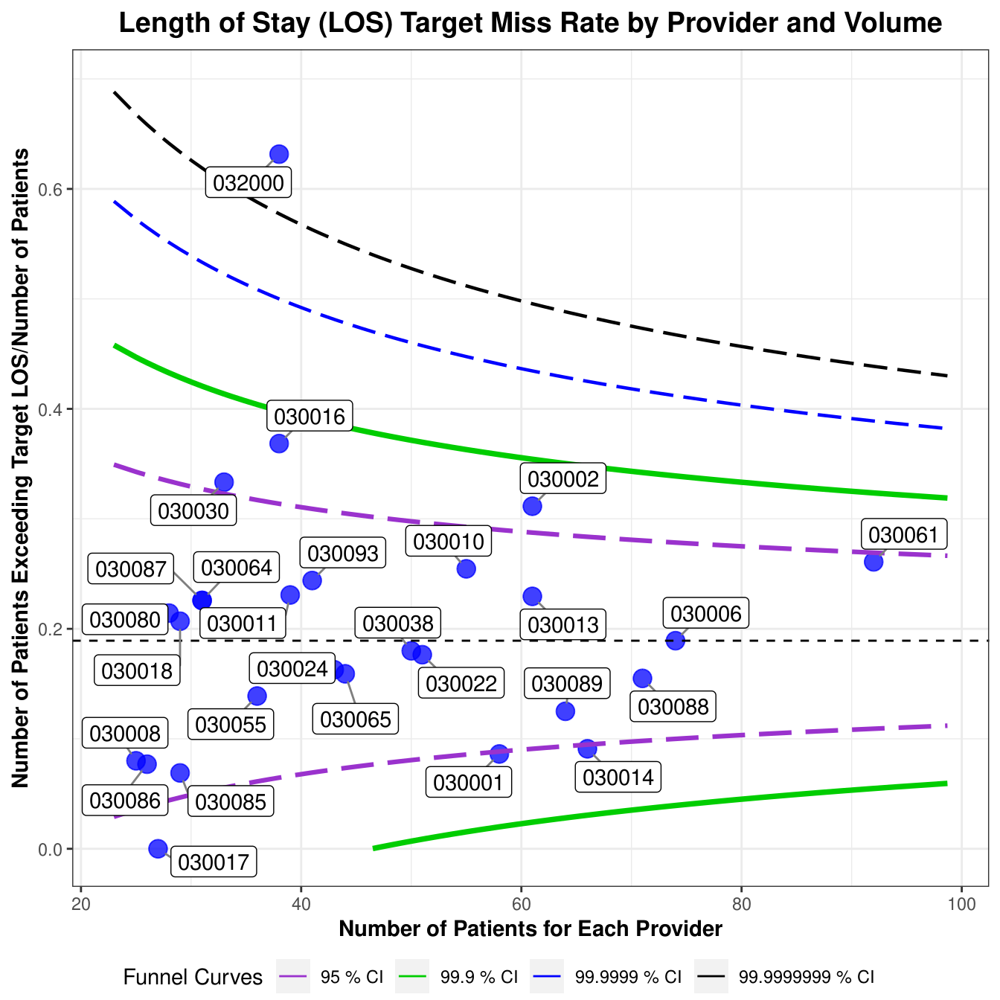
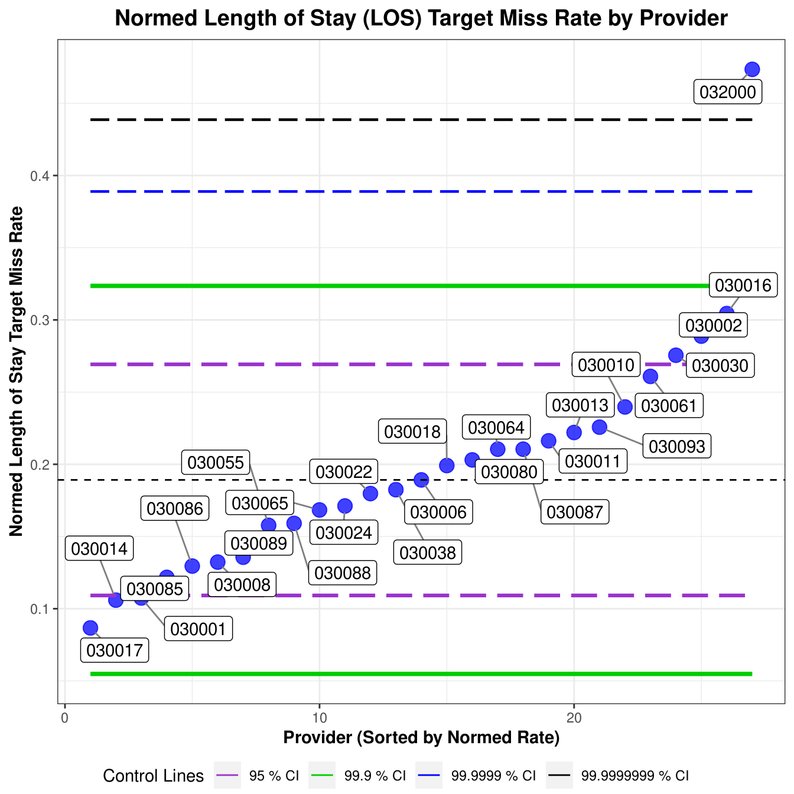
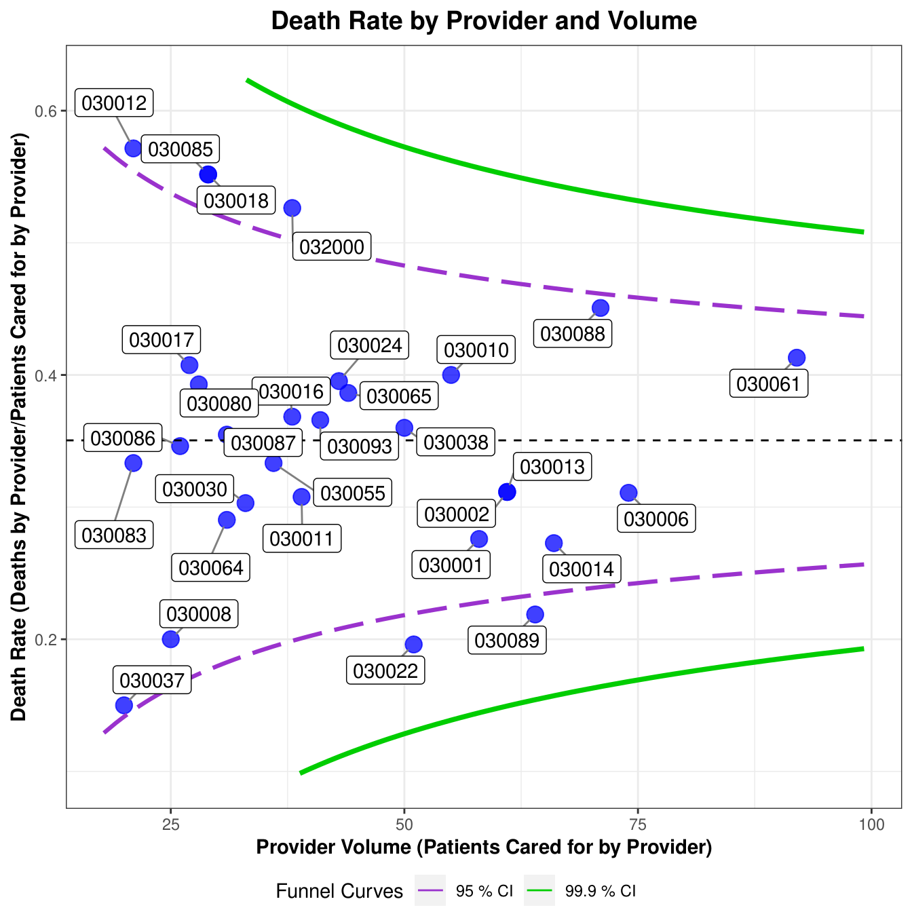
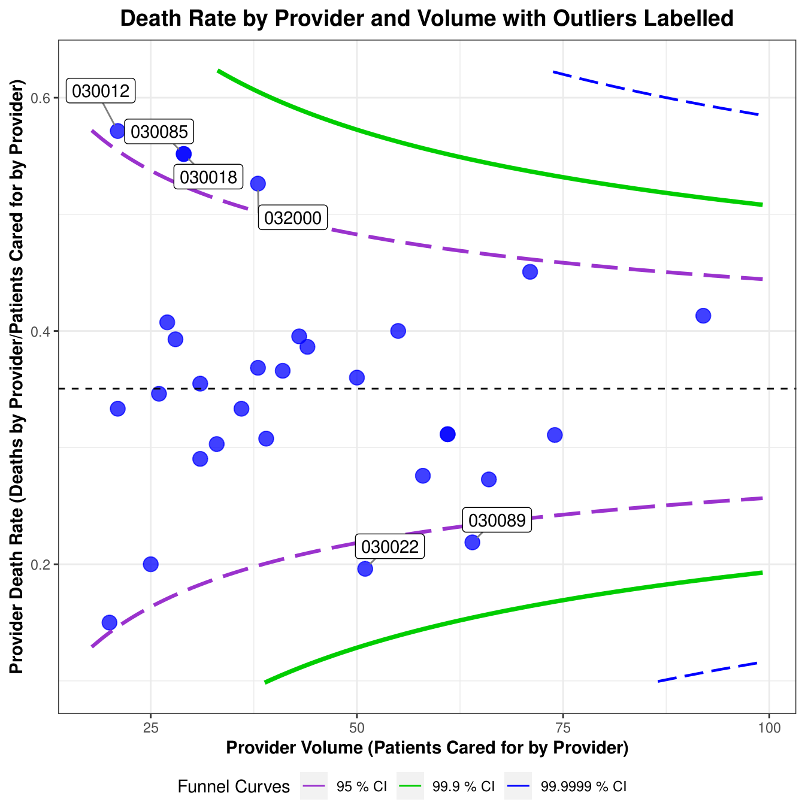

<!DOCTYPE html>

<html>

<head>

<meta charset="utf-8" />
<meta name="generator" content="pandoc" />
<meta http-equiv="X-UA-Compatible" content="IE=EDGE" />

<title>README.utf8</title>

<meta name="viewport" content="width=device-width, initial-scale=1" />
<link href="README_files/bootstrap-3.3.5/css/bootstrap.min.css" rel="stylesheet" />

<link href="README_files/highlightjs-9.12.0/default.css" rel="stylesheet" />

<!-- tabsets -->

<!-- code folding -->

</head>

<body>

<h2>Installation</h2>

The code can be installed in R from GitHub using the <code>remotes</code> (or <code>devtools</code>) package. Please be aware that as development code, it may be broken at times.

<pre class="r"><code>remotes::install_github(&quot;https://github.com/mbonert/cmpproviders&quot;)</code></pre>

<h2>The provider factor</h2>

The provider is a known predictor of outcome in healthcare ( <a href="https://www.doi.org/10.1056/NEJM198903163201106" class="uri">https://www.doi.org/10.1056/NEJM198903163201106</a> <a href="https://www.doi.org/10.1038/s41598-022-26962-w" class="uri">https://www.doi.org/10.1038/s41598-022-26962-w</a> ). In the quality improvement context: it is useful to understand the magnitude of differences and, more generally, the variability.

<h2>Funnel plots</h2>

Funnel plots are useful to understand variability and the magnitude of differences. Properly constructed, they can be understood by most practicing physicians/surgeons with modest effort.

This code borrows ideas from the package “FunnelPlotR” ( <a href="https://github.com/cran/FunnelPlotR" class="uri">https://github.com/cran/FunnelPlotR</a> ). The main differences to that package are: (1) this code uses the raw rate data (instead of the standardized ratio), (2) the confidence intervals the funnels represent can be adjusted, and (3) an arbitrary number of funnels can be plotted in the same figure.

In the quality of care context, funnel plots were described by Spiegelhalter in 2005 ( <a href="https://www.doi.org/10.1002/sim.1970" class="uri">https://www.doi.org/10.1002/sim.1970</a> ). They have been applied in surgery ( <a href="https://www.doi.org/10.1097/SLA.0b013e31819a47b1" class="uri">https://www.doi.org/10.1097/SLA.0b013e31819a47b1</a> ), obstetrics ( <a href="https://www.doi.org/10.1136/bmj.c5065" class="uri">https://www.doi.org/10.1136/bmj.c5065</a> ) and pathology ( <a href="https://www.doi.org/10.4103/jpi.jpi_50_17" class="uri">https://www.doi.org/10.4103/jpi.jpi_50_17</a> ) .

<h2>Control charts</h2>

Control charts (also known as Shewhart charts, after Walter A. Shewhart) are analogous to funnel plots; they show a variable in relation to expected variation. They are also tool of statistical process control/Next Generation Quality.

The control chart, as used here, can be thought of a normalized form of the funnel plot, that allows comparisons to a specified rate ( <a href="https://www.doi.org/10.1371/journal.pone.0242656" class="uri">https://www.doi.org/10.1371/journal.pone.0242656</a> <a href="https://www.doi.org/10.1038/s41598-021-95862-2" class="uri">https://www.doi.org/10.1038/s41598-021-95862-2</a> ).

Sorted control charts are easier to read and obscure the volume, something that may be useful to maintain a level of anonymity ( <a href="https://www.doi.org/10.1371/journal.pone.0242656" class="uri">https://www.doi.org/10.1371/journal.pone.0242656</a> ).

<h3>Example 1 (Length of Stay)</h3>
<pre class="r"><code>library(cmpproviders)
library(COUNT)
library(dplyr)
data(medpar)

print(&quot;Get number of patients by provider ...&quot;)
#&gt; [1] &quot;Get number of patients by provider ...&quot;
provider_count=as.data.frame(table(medpar$provnum))
colnames(provider_count) = c(&#39;Provider&#39;, &#39;Count&#39;)
provider_count
#&gt;    Provider Count
#&gt; 1    030001    58
#&gt; 2    030002    61
#&gt; 3    030003     6
#&gt; 4    030006    74
#&gt; 5    030007    13
#&gt; 6    030008    25
#&gt; 7    030009    16
#&gt; 8    030010    55
#&gt; 9    030011    39
#&gt; 10   030012    21
#&gt; 11   030013    61
#&gt; 12   030014    66
#&gt; 13   030016    38
#&gt; 14   030017    27
#&gt; 15   030018    29
#&gt; 16   030019    17
#&gt; 17   030022    51
#&gt; 18   030023     4
#&gt; 19   030024    43
#&gt; 20   030025     3
#&gt; 21   030030    33
#&gt; 22   030033     1
#&gt; 23   030035     6
#&gt; 24   030036    12
#&gt; 25   030037    20
#&gt; 26   030038    50
#&gt; 27   030043    15
#&gt; 28   030044     2
#&gt; 29   030055    36
#&gt; 30   030059     4
#&gt; 31   030060     2
#&gt; 32   030061    92
#&gt; 33   030062    18
#&gt; 34   030064    31
#&gt; 35   030065    44
#&gt; 36   030067     5
#&gt; 37   030068     1
#&gt; 38   030069    19
#&gt; 39   030073     4
#&gt; 40   030078     3
#&gt; 41   030080    28
#&gt; 42   030083    21
#&gt; 43   030084     3
#&gt; 44   030085    29
#&gt; 45   030086    26
#&gt; 46   030087    31
#&gt; 47   030088    71
#&gt; 48   030089    64
#&gt; 49   030092    15
#&gt; 50   030093    41
#&gt; 51   030094    11
#&gt; 52   032000    38
#&gt; 53   032002    10
#&gt; 54   032003     2

print(&quot;Purging providers with less than 25 patients ...&quot;)
#&gt; [1] &quot;Purging providers with less than 25 patients ...&quot;
requiredcases=25
medpar_trunc &lt;- medpar[medpar$provnum %in% provider_count[provider_count$Count&gt;=requiredcases,]$Provider,]

print(&quot;Number of patients by provider in purged data set ...&quot;)
#&gt; [1] &quot;Number of patients by provider in purged data set ...&quot;
provider_count_trunc=as.data.frame(table(medpar_trunc$provnum))
colnames(provider_count_trunc) = c(&#39;Provider&#39;, &#39;Count&#39;)
provider_count_trunc
#&gt;    Provider Count
#&gt; 1    030001    58
#&gt; 2    030002    61
#&gt; 3    030006    74
#&gt; 4    030008    25
#&gt; 5    030010    55
#&gt; 6    030011    39
#&gt; 7    030013    61
#&gt; 8    030014    66
#&gt; 9    030016    38
#&gt; 10   030017    27
#&gt; 11   030018    29
#&gt; 12   030022    51
#&gt; 13   030024    43
#&gt; 14   030030    33
#&gt; 15   030038    50
#&gt; 16   030055    36
#&gt; 17   030061    92
#&gt; 18   030064    31
#&gt; 19   030065    44
#&gt; 20   030080    28
#&gt; 21   030085    29
#&gt; 22   030086    26
#&gt; 23   030087    31
#&gt; 24   030088    71
#&gt; 25   030089    64
#&gt; 26   030093    41
#&gt; 27   032000    38

print(&quot;Use &#39;14&#39; as the target length of stay ...&quot;)
#&gt; [1] &quot;Use &#39;14&#39; as the target length of stay ...&quot;
target_los=14
medpar_trunc_gt_target_los &lt;- medpar_trunc[medpar_trunc$los&gt;target_los,]

medpar_trunc$gt_target_los=0
medpar_trunc[medpar_trunc$los&gt;target_los,]$gt_target_los &lt;- 1
prov_vs_missrate_table=table( medpar_trunc$provnum, medpar_trunc$gt_target_los)
num_prov=dim(prov_vs_missrate_table)[1]

prov_matrix = matrix(NA, num_prov, 3)
prov_matrix[,1]=prov_vs_missrate_table[,2]
prov_matrix[,2]=prov_vs_missrate_table[,1]+prov_vs_missrate_table[,2]
prov_matrix[,3]=prov_matrix[,1]/prov_matrix[,2]
colnames(prov_matrix) = c(&#39;Exceed LOS target&#39;, &#39;Patient count&#39;, &#39;Miss rate&#39;)
prov_matrix
#&gt;       Exceed LOS target Patient count  Miss rate
#&gt;  [1,]                 5            58 0.08620690
#&gt;  [2,]                19            61 0.31147541
#&gt;  [3,]                14            74 0.18918919
#&gt;  [4,]                 2            25 0.08000000
#&gt;  [5,]                14            55 0.25454545
#&gt;  [6,]                 9            39 0.23076923
#&gt;  [7,]                14            61 0.22950820
#&gt;  [8,]                 6            66 0.09090909
#&gt;  [9,]                14            38 0.36842105
#&gt; [10,]                 0            27 0.00000000
#&gt; [11,]                 6            29 0.20689655
#&gt; [12,]                 9            51 0.17647059
#&gt; [13,]                 7            43 0.16279070
#&gt; [14,]                11            33 0.33333333
#&gt; [15,]                 9            50 0.18000000
#&gt; [16,]                 5            36 0.13888889
#&gt; [17,]                24            92 0.26086957
#&gt; [18,]                 7            31 0.22580645
#&gt; [19,]                 7            44 0.15909091
#&gt; [20,]                 6            28 0.21428571
#&gt; [21,]                 2            29 0.06896552
#&gt; [22,]                 2            26 0.07692308
#&gt; [23,]                 7            31 0.22580645
#&gt; [24,]                11            71 0.15492958
#&gt; [25,]                 8            64 0.12500000
#&gt; [26,]                10            41 0.24390244
#&gt; [27,]                24            38 0.63157895

x_var=prov_matrix[,2]
y_var=prov_matrix[,3]

provider_labels = provider_count_trunc[,1]

print(&quot;Creating funnel plot ...&quot;)
#&gt; [1] &quot;Creating funnel plot ...&quot;
fp=funnel2cmpproviders(x_var, y_var, limits=c(95,99.9,99.9999,99.9999999), labels=provider_labels, addlabels = 1, x_label = &quot;Number of Patients for Each Provider&quot;, y_label = &quot;Number of Patients Exceeding Target LOS/Number of Patients&quot;, plot_title = &quot;Length of Stay (LOS) Target Miss Rate by Provider and Volume&quot;, y_percent=FALSE)</code></pre>

<pre class="r"><code>
print(&quot;Creating control chart ...&quot;)
#&gt; [1] &quot;Creating control chart ...&quot;
cc=controlchart2cmpproviders(x_var, y_var, limits=c(95,99.9,99.9999,99.9999999), labels=provider_labels, addlabels = 1, x_label = &quot;Provider (Sorted by Normed Rate)&quot;, y_label = &quot;Normed Length of Stay Target Miss Rate&quot;, plot_title = &quot;Normed Length of Stay (LOS) Target Miss Rate by Provider&quot;, y_percent=FALSE)</code></pre>

<h3>Example 2 (Death Rate)</h3>
<pre class="r"><code>library(cmpproviders)
library(COUNT)
library(dplyr)
data(medpar)

print(&quot;Number of patients by provider ...&quot;)
#&gt; [1] &quot;Number of patients by provider ...&quot;
provider_count=as.data.frame(table(medpar$provnum))
colnames(provider_count) = c(&#39;Provider&#39;, &#39;Count&#39;)
provider_count
#&gt;    Provider Count
#&gt; 1    030001    58
#&gt; 2    030002    61
#&gt; 3    030003     6
#&gt; 4    030006    74
#&gt; 5    030007    13
#&gt; 6    030008    25
#&gt; 7    030009    16
#&gt; 8    030010    55
#&gt; 9    030011    39
#&gt; 10   030012    21
#&gt; 11   030013    61
#&gt; 12   030014    66
#&gt; 13   030016    38
#&gt; 14   030017    27
#&gt; 15   030018    29
#&gt; 16   030019    17
#&gt; 17   030022    51
#&gt; 18   030023     4
#&gt; 19   030024    43
#&gt; 20   030025     3
#&gt; 21   030030    33
#&gt; 22   030033     1
#&gt; 23   030035     6
#&gt; 24   030036    12
#&gt; 25   030037    20
#&gt; 26   030038    50
#&gt; 27   030043    15
#&gt; 28   030044     2
#&gt; 29   030055    36
#&gt; 30   030059     4
#&gt; 31   030060     2
#&gt; 32   030061    92
#&gt; 33   030062    18
#&gt; 34   030064    31
#&gt; 35   030065    44
#&gt; 36   030067     5
#&gt; 37   030068     1
#&gt; 38   030069    19
#&gt; 39   030073     4
#&gt; 40   030078     3
#&gt; 41   030080    28
#&gt; 42   030083    21
#&gt; 43   030084     3
#&gt; 44   030085    29
#&gt; 45   030086    26
#&gt; 46   030087    31
#&gt; 47   030088    71
#&gt; 48   030089    64
#&gt; 49   030092    15
#&gt; 50   030093    41
#&gt; 51   030094    11
#&gt; 52   032000    38
#&gt; 53   032002    10
#&gt; 54   032003     2

print(&quot;Purging providers with less than 20 patients ...&quot;)
#&gt; [1] &quot;Purging providers with less than 20 patients ...&quot;
requiredcases=20
medpar_trunc &lt;- medpar[medpar$provnum %in% provider_count[provider_count$Count&gt;=requiredcases,]$Provider,]

print(&quot;Number of patients by provider in purged data set ...&quot;)
#&gt; [1] &quot;Number of patients by provider in purged data set ...&quot;
provider_count_trunc=as.data.frame(table(medpar_trunc$provnum))
colnames(provider_count_trunc) = c(&#39;Provider&#39;, &#39;Count&#39;)
provider_count_trunc
#&gt;    Provider Count
#&gt; 1    030001    58
#&gt; 2    030002    61
#&gt; 3    030006    74
#&gt; 4    030008    25
#&gt; 5    030010    55
#&gt; 6    030011    39
#&gt; 7    030012    21
#&gt; 8    030013    61
#&gt; 9    030014    66
#&gt; 10   030016    38
#&gt; 11   030017    27
#&gt; 12   030018    29
#&gt; 13   030022    51
#&gt; 14   030024    43
#&gt; 15   030030    33
#&gt; 16   030037    20
#&gt; 17   030038    50
#&gt; 18   030055    36
#&gt; 19   030061    92
#&gt; 20   030064    31
#&gt; 21   030065    44
#&gt; 22   030080    28
#&gt; 23   030083    21
#&gt; 24   030085    29
#&gt; 25   030086    26
#&gt; 26   030087    31
#&gt; 27   030088    71
#&gt; 28   030089    64
#&gt; 29   030093    41
#&gt; 30   032000    38

medpar_trunc_died &lt;- medpar_trunc[medpar_trunc$died==1,]

print(&quot;Number of died by provider in purged data set ...&quot;)
#&gt; [1] &quot;Number of died by provider in purged data set ...&quot;
provider_count_trunc_died=as.data.frame(table(medpar_trunc_died$provnum))
colnames(provider_count_trunc_died) = c(&#39;Provider&#39;, &#39;Count&#39;)
provider_count_trunc_died
#&gt;    Provider Count
#&gt; 1    030001    16
#&gt; 2    030002    19
#&gt; 3    030006    23
#&gt; 4    030008     5
#&gt; 5    030010    22
#&gt; 6    030011    12
#&gt; 7    030012    12
#&gt; 8    030013    19
#&gt; 9    030014    18
#&gt; 10   030016    14
#&gt; 11   030017    11
#&gt; 12   030018    16
#&gt; 13   030022    10
#&gt; 14   030024    17
#&gt; 15   030030    10
#&gt; 16   030037     3
#&gt; 17   030038    18
#&gt; 18   030055    12
#&gt; 19   030061    38
#&gt; 20   030064     9
#&gt; 21   030065    17
#&gt; 22   030080    11
#&gt; 23   030083     7
#&gt; 24   030085    16
#&gt; 25   030086     9
#&gt; 26   030087    11
#&gt; 27   030088    32
#&gt; 28   030089    14
#&gt; 29   030093    15
#&gt; 30   032000    20

print(&quot;Death rate by provider ...&quot;)
#&gt; [1] &quot;Death rate by provider ...&quot;
y_var = provider_count_trunc_died[,2]/ provider_count_trunc[,2]
y_var
#&gt;  [1] 0.2758621 0.3114754 0.3108108 0.2000000 0.4000000 0.3076923 0.5714286
#&gt;  [8] 0.3114754 0.2727273 0.3684211 0.4074074 0.5517241 0.1960784 0.3953488
#&gt; [15] 0.3030303 0.1500000 0.3600000 0.3333333 0.4130435 0.2903226 0.3863636
#&gt; [22] 0.3928571 0.3333333 0.5517241 0.3461538 0.3548387 0.4507042 0.2187500
#&gt; [29] 0.3658537 0.5263158

x_var = provider_count_trunc[,2]
provider_labels = provider_count_trunc[,1]

print(&quot;Creating funnel plots ...&quot;)
#&gt; [1] &quot;Creating funnel plots ...&quot;

fp=funnel2cmpproviders(x_var, y_var, limits=c(95,99.9), labels=provider_labels, addlabels = 1, x_label = &quot;Provider Volume (Patients Cared for by Provider)&quot;, y_label = &quot;Death Rate (Deaths by Provider/Patients Cared for by Provider)&quot;, plot_title = &quot;Death Rate by Provider and Volume&quot;) </code></pre>

<pre class="r"><code>
print(&quot;Labelling one provider (030006) ...&quot;)
#&gt; [1] &quot;Labelling one provider (030006) ...&quot;
fp=funnel2cmpproviders(x_var, y_var, limits=c(95,99.9), labels=provider_labels, addlabels = &#39;LIST&#39;, labels_to_display = c(&quot;030006&quot;), x_label = &quot;Provider Volume (Patients Cared for by Provider)&quot;, y_label = &quot;Death Rate (Deaths by Provider/Patients Cared for by Provider)&quot;, plot_title = &quot;Death Rate by Provider and Volume&quot;) </code></pre>

<pre class="r"><code>
print(&quot;Labels only the outliers ...&quot;)
#&gt; [1] &quot;Labels only the outliers ...&quot;
fp=funnel2cmpproviders(x_var, y_var, limits=c(95,99.9,99.9999), labels=provider_labels, addlabels = &quot;OUTLIERS&quot;, x_label = &quot;Provider Volume (Patients Cared for by Provider)&quot;, y_label = &quot;Provider Death Rate (Deaths by Provider/Patients Cared for by Provider)&quot;, plot_title = &quot;Death Rate by Provider and Volume with Outliers Labelled&quot;) </code></pre>

<pre class="r"><code>

print(&quot;Creating control chart ...&quot;)
#&gt; [1] &quot;Creating control chart ...&quot;

cc=controlchart2cmpproviders(x_var, y_var, limits=c(95,99.9,99.9999), labels=provider_labels, addlabels = &quot;OUTLIERS&quot;, x_label = &quot;Provider (Sorted by Normed Rate)&quot;, y_label = &quot;Normed Provider Death Rate&quot;, plot_title = &quot;Normed Death Rate by Provider with Outliers Labelled&quot;)</code></pre>

<!-- tabsets -->

<!-- code folding -->

<!-- dynamically load mathjax for compatibility with self-contained -->

</body>
</html>
